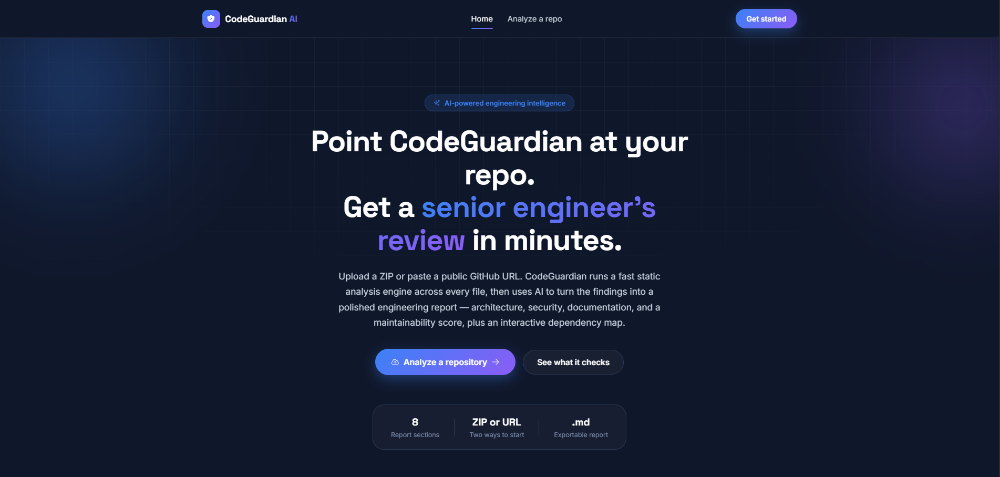
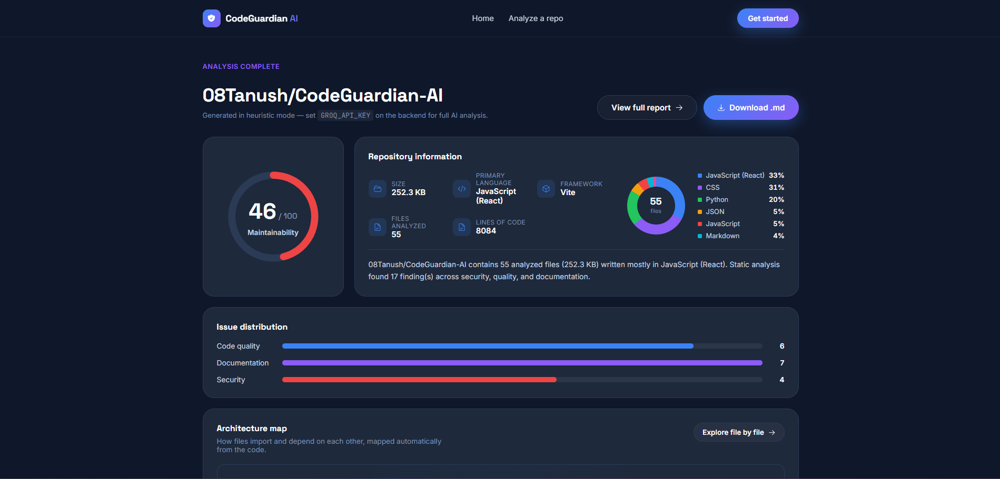
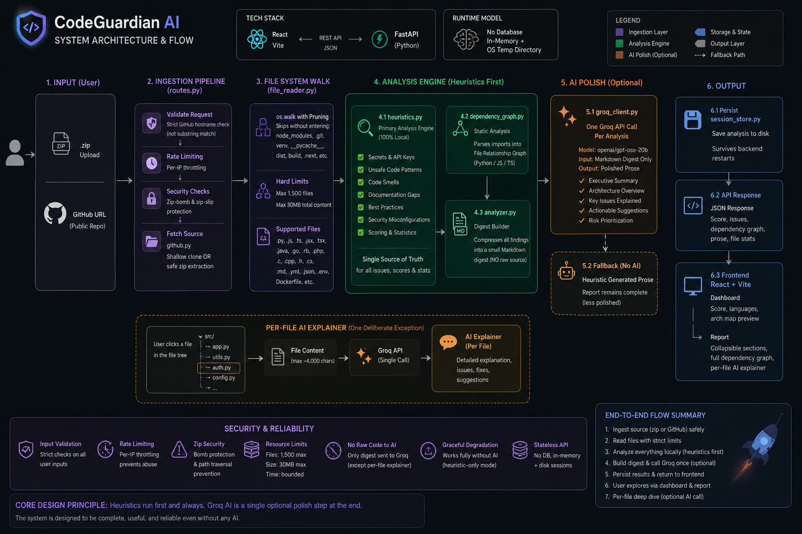
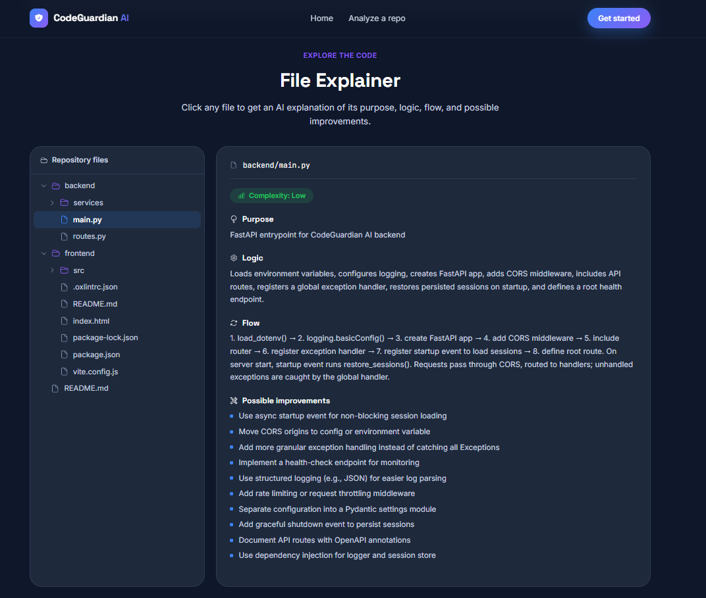

# CodeGuardian AI

An AI-powered engineering intelligence platform. Upload a repository (ZIP or
public GitHub URL) and get a full engineering report: architecture, security,
code quality, documentation, AI suggestions, an interactive dependency map,
and a maintainability score — plus a per-file AI explainer.


---

## Screenshots

> A look at CodeGuardian AI in action — from repository analysis to interactive architecture visualization and file-level explanations.

> [Adding your own screenshots](#adding-your-own-screenshots) below.

| Landing page | Dashboard |
|---|---|
|  |  |

| Architecture map | File explainer |
|---|---|
|  |  |

### Adding your own screenshots

1. Run the app locally (see [Installation](#installation) below).
2. Take screenshots of the pages you want to show off — the landing page,
   the dashboard, the architecture map, and the file explainer are good
   choices.
3. Save them into `docs/screenshots/` in this repo, using the filenames
   above (`landing.png`, `dashboard.png`, `architecture-map.png`,
   `file-explainer.png`) — or update the paths in this README to match
   whatever you name them.
4. Commit and push - GitHub will render them automatically in this README.

---

## Features

- **Two ways to start**: upload a `.zip` archive or paste a public GitHub URL
- **Maintainability score** computed deterministically from real static
  analysis findings - not a black-box number
- **Security, code quality, and documentation analysis** via a fast,
  dependency-free heuristic engine (hardcoded secrets, unsafe `eval`/`pickle`
  usage, disabled TLS verification, SQL string concatenation, long
  files/functions, deep nesting, missing docstrings, and more)
- **Interactive architecture map** - a force-directed graph of how files
  import one another, built from static analysis, clickable to jump straight
  into that file's AI explanation
- **AI-polished report prose** - one lightweight Groq request per analysis
  turns the static analysis findings into a readable summary, architecture
  overview, and actionable suggestions (see [How analysis
  works](#how-analysis-works))
- **Per-file AI explainer** - click any file in the repo tree to get its
  purpose, logic, flow, and improvement suggestions
- **Downloadable Markdown report** for sharing outside the app
- **Works without an API key** - falls back to a complete heuristic-only
  report if Groq isn't configured or is temporarily rate-limited

---

## How analysis works

**Full-repository analysis never sends your source code to an AI model.**

1. A fast, dependency-free heuristic engine (`backend/services/heuristics.py`)
   scans every file for real patterns and computes every issue, score, and
   stat in the report. No AI call, no rate limits, no token cost - and it
   scales fine to large repositories.
2. Those findings are compressed into a small Markdown digest (not raw code).
3. **One** lightweight Groq request per analysis turns that digest into
   polished prose. If Groq is unavailable, rate-limited, or misconfigured,
   the report is still complete - just with heuristic-generated prose
   instead of AI-polished prose. No findings are ever lost to an AI failure.

**The per-file AI explainer is the one deliberate exception** - clicking a
file *does* send its content (up to ~4,000 characters) to Groq so it can
explain that specific file. Worth knowing if you're analyzing a repo with
sensitive code. It also falls back to a heuristic-only explanation if Groq
is unavailable.

---

## Tech stack

| Layer | Technology |
|---|---|
| Frontend | React 19, React Router, Axios, Framer Motion, React Icons, plain CSS |
| Backend | FastAPI, GitPython, Groq API (`openai/gpt-oss-20b`), `zipfile` |
| No database, no auth | Everything lives in memory + the OS temp directory for the life of the server process |

---

## Project structure

```
CodeGuardian-AI/
├── backend/
│   ├── main.py                   FastAPI app + CORS + global exception handler
│   ├── routes.py                  All API endpoints (rate limiting, upload hardening)
│   ├── requirements.txt
│   ├── .env.example                Copy to .env and add your GROQ_API_KEY
│   └── services/
│       ├── heuristics.py             Primary analysis engine (no AI needed)
│       ├── analyzer.py                Orchestrates heuristics + one optional Groq call
│       ├── groq_client.py              Groq API wrapper
│       ├── github.py                    Clones public GitHub repos (size-guarded)
│       ├── file_reader.py               Repo walking / safe file reading
│       ├── dependency_graph.py          Static import parser -> architecture graph
│       ├── report_generator.py          Builds the downloadable Markdown report
│       ├── session_store.py             Persists sessions to disk (survives restarts)
│       └── utils.py                     Shared helpers
│
├── frontend/
│   ├── package.json
│   ├── .env                        VITE_API_BASE_URL (defaults to localhost:8000)
│   └── src/
│       ├── pages/                    Landing, Upload, Loading, Dashboard, Report
│       ├── components/                 Navbar, Footer, ScoreGauge, DependencyGraph,
│       │                                LanguageDonut, FileExplorer, FileExplainerPanel, ...
│       ├── utils/forceLayout.js         Dependency-free force-directed graph layout
│       ├── services/api.js              Axios wrapper for the backend
│       └── context/AnalysisContext.jsx  Holds the active session across pages
│
└── docs/screenshots/               Put your own screenshots here (see above)
```

---

## Installation

### Prerequisites

- **Python 3.11+** with `pip`
- **Node.js 20+** with `npm`
- **git** (for both cloning this repo and for the app's own GitHub-URL analysis feature)

### 1. Clone this repo

```bash
git clone https://github.com/<your-username>/CodeGuardian-AI.git
cd CodeGuardian-AI
```

### 2. Backend setup

```bash
cd backend
pip install -r requirements.txt
```

Copy the example environment file and add your Groq API key (optional but
recommended - see [How analysis works](#how-analysis-works) for what
happens without one):

```bash
# macOS/Linux
cp .env.example .env

# Windows (PowerShell)
Copy-Item .env.example .env
```

Open `.env` and set:
```
GROQ_API_KEY=gsk_your_actual_key_here
```
Get a free key at [console.groq.com/keys](https://console.groq.com/keys).

Start the backend:
```bash
uvicorn main:app --reload
```
It runs at `http://localhost:8000`. Interactive API docs at
`http://localhost:8000/docs`.

### 3. Frontend setup

In a **second terminal**:

```bash
cd frontend
npm install
npm run dev
```
It runs at `http://localhost:5173`.

### 4. Open the app

Go to `http://localhost:5173` in your browser. Paste a public GitHub URL or
upload a `.zip` archive to run your first analysis.

---

## Deployment

CodeGuardian AI deploys as two independent pieces: a static frontend (Vercel)
and a persistent Python backend (Render, Railway, Fly.io, or similar). The
backend is intentionally **not** deployed as a Vercel serverless function -
it clones/extracts repositories and can process fairly large uploads, which
doesn't fit well within serverless request/response body and execution-time
limits. A small, always-on Python process is the right fit here.

### Frontend -> Vercel

1. Push this repo to GitHub (see below if you haven't yet).
2. In Vercel, "Add New Project" -> import the repo -> set **Root Directory**
   to `frontend`.
3. Build command: `npm run build` (Vercel detects this automatically for a
   Vite project). Output directory: `dist`.
4. Add an environment variable in the Vercel project settings:
   ```
   VITE_API_BASE_URL=https://your-deployed-backend-url.com/api
   ```
   (set this to wherever you deploy the backend - see below)
5. Deploy. `vercel.json` in this repo already configures the SPA rewrite
   needed so direct links like `/dashboard/abc123` work on refresh instead
   of 404ing - no extra Vercel config needed.

### Backend -> Render / Railway / Fly.io (or any persistent Python host)

These instructions are written generically since the steps are nearly
identical across providers - pick whichever you prefer.

1. Point the service at the `backend/` directory of this repo.
2. Install command: `pip install -r requirements.txt`
3. Start command:
   ```
   uvicorn main:app --host 0.0.0.0 --port $PORT
   ```
   (most platforms inject `$PORT` automatically; `main.py` also has a
   `python main.py` fallback that reads `PORT` itself, in case your
   platform runs the app directly instead of via a `uvicorn` start command)
4. Set environment variables in the platform's dashboard (never commit
   these - see `.env.example` in `backend/`):
   ```
   GROQ_API_KEY=your_real_key
   CORS_ORIGINS=https://your-frontend.vercel.app
   ```
5. Deploy, then confirm `GET https://your-backend-url.com/api/health`
   returns `{"status":"ok"}`.
6. Go back to your Vercel frontend's environment variables and set
   `VITE_API_BASE_URL` to this backend's URL + `/api`, then redeploy the
   frontend so it picks up the change.

### A note on storage in production

Uploaded/cloned repos and session data live in the OS temp directory of
whichever machine the backend process is running on (see "Notes" below).
This works fine for a single backend instance, but two important
consequences for production:
- If your host restarts or redeploys the backend, in-progress temp data is
  cleared - the app handles this gracefully (sessions persist to disk and
  reload on startup, as long as the *same* disk still exists after
  restart; a full redeploy to a fresh container will not preserve old
  sessions, and users will see "Analysis not found" for links from before
  the redeploy).
- If you ever scale the backend to multiple instances behind a load
  balancer, session data won't be shared between them. This is a real
  architectural limitation of the current in-memory + local-disk design.
  Solving it properly would mean introducing a shared database, which was
  explicitly out of scope for this pass - noting it here as a known
  limitation rather than silently working around it.

### CORS

The backend's `CORS_ORIGINS` environment variable is a comma-separated
list of allowed frontend origins. In production, set it to your exact
Vercel domain (not a wildcard) - e.g.:
```
CORS_ORIGINS=https://codeguardian-ai.vercel.app
```
Leaving it unset falls back to the local dev origins only
(`localhost:5173`, `localhost:3000`), which will correctly block a
production frontend from an unconfigured backend - a sign you forgot this
step, not a bug.

---

## API endpoints

| Method | Path | Purpose |
|---|---|---|
| GET | `/api/health` | Health check |
| POST | `/api/upload/zip` | Upload + analyze a ZIP repository |
| POST | `/api/upload/github` | Clone + analyze a public GitHub repo |
| GET | `/api/analysis/{id}` | Fetch a previously computed analysis |
| POST | `/api/file/explain` | AI explanation of a single file |
| GET | `/api/report/{id}/download` | Download the Markdown report |

Full interactive docs (Swagger UI) are available at `/docs` while the
backend is running.

---

## Security & robustness

- **Zip bomb protection** - uploads are checked for total uncompressed size
  and entry count before extraction, not after
- **Zip-slip protection** - any entry with an absolute path or `..`
  traversal segment is rejected before extraction
- **GitHub URL validation** - strict hostname parsing (not a substring
  check), so a URL like `evil.com/?x=github.com/...` is correctly rejected
- **Rate limiting** - a simple in-memory per-IP limit on the two
  analysis-triggering endpoints (default: 8 requests / 5 minutes)
- **GitHub clone size guard** - clones are size-checked and
  rejected/cleaned up if too large; credential prompts are disabled so a
  private/nonexistent repo fails fast instead of hanging
- **Global exception handler** - unhandled errors return a clean, generic
  JSON message to the client; full tracebacks are only ever logged
  server-side, never leaked to the response
- **Server-side upload size limit** (50MB), not just a frontend-side check

---

## Troubleshooting

**"Graph edges look wrong or incomplete"** - This was a real cross-platform
bug: canonical file paths were built with OS-native separators, so on
Windows a file path like `src\\App.jsx` (backslashes) never matched what
the dependency graph expected (`src/App.jsx`, forward slashes only), and
edges silently failed to resolve. Every path is now normalized through
`services/path_utils.py` at the point it's first constructed, so this
should no longer happen regardless of OS. The graph also now reports
transparent diagnostics (`resolvedCount`/`unresolvedCount`/`externalCount`)
instead of silently dropping anything it couldn't resolve - genuinely
unresolved imports show up with a reason instead of just disappearing.


**"AI analysis isn't running (report shows heuristic mode)"** - Check your
backend terminal right after an analysis. It always logs the real reason,
e.g.:
```
[WARNING] codeguardian.groq: GROQ_API_KEY is not set - falling back to heuristic analysis.
```
Common causes: `.env` is missing or in the wrong folder (it must sit next to
`main.py`, inside `backend/`), the file was saved with an encoding
`python-dotenv` can't parse (recreate it with
`python -c "open('.env','w').write('GROQ_API_KEY=your_key')"` if
`Get-Content .env` looks empty/garbled), or you forgot to restart `uvicorn`
after adding the key.

**"Analysis not found. It may have expired."** - Sessions persist to disk
and reload automatically on server startup, so this should only happen if
the OS temp directory was cleared (e.g. a reboot). Re-upload the repo.

**Frontend `npm run dev` fails with a Rolldown/native-binding error** - This
is a known npm bug with Vite's optional native dependencies. This repo pins
`vite` to a stable Rollup-based version in `package.json` specifically to
avoid it - if you still hit it, delete `node_modules` and
`package-lock.json` and run `npm install` again.

---

## License

MIT - see [LICENSE](LICENSE) (add one if you don't have it yet - GitHub can
generate one for you when creating the repo, or after the fact from the
repo's "Add file" menu).

---

## Acknowledgements

Built as a portfolio project demonstrating a full-stack AI-integrated
application: FastAPI + React, static analysis engineering, and pragmatic
AI-cost design (heuristics-first, AI-polish-second).
